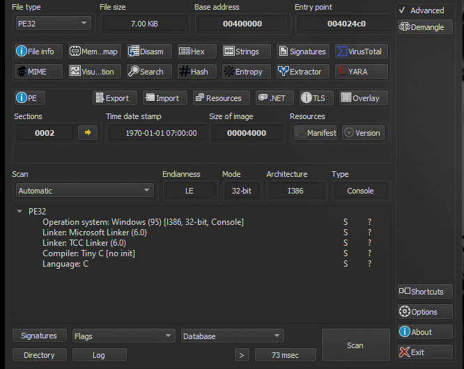
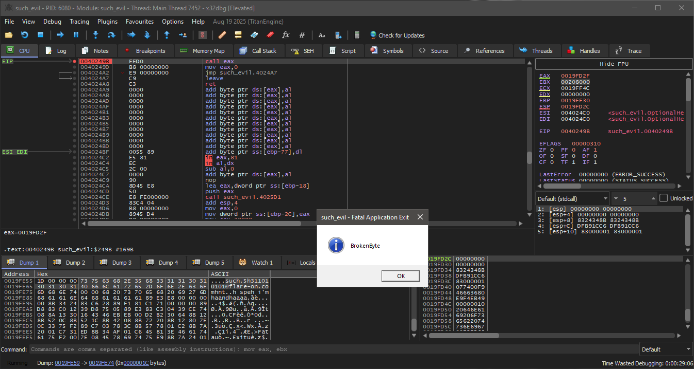

# FlareOn 2014 - Challenge 3: Debugging the Validation Loop

## 1. Initial Inspection & Debugging Setup

We load the Challenge 3 executable to evaluate its protection mechanisms and input processing flow. The executable takes an input parameter and performs validation checks.

We run the executable inside the `x64dbg` debugger.

We locate the primary logic loop by tracing the flow from the entry point. The executable sets up decryption buffers and loops through character offsets to validate our input.

---

## 2. Tracing the Decryption Logic

Rather than statically reversing the encoding math, we use the debugger to step through execution. The validation logic runs a decryption routine that decrypts the flag in memory. 

By setting breakpoints at the exit of the primary evaluation loops, we allow the program to decode the memory buffers.

As the execution hits the final loops, the program dumps the resolved flag string into the target registers. We read the flag directly from memory:

`such.5h311010101@flare-on.com`

---

## 3. Lessons Learned

Executing binaries dynamically often bypasses complex code obfuscation. Running the program to its final validation boundary allows the runtime environment to resolve key values automatically, avoiding manual calculation of decryption algorithms.
