# FlareOn 2014 - Challenge 5: DLL Keylogger & Key Mapping Automation

## 1. Initial Reconnaissance & DIE Inspection

We begin analyzing the Challenge 5 binary. We load it into **Detect It Easy (DIE)** to inspect its format and imports.

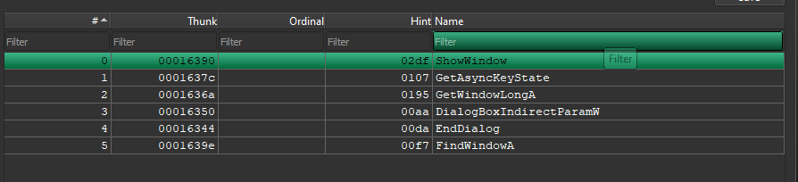

The binary is a dynamic-link library (DLL) rather than an executable. Analyzing the Import Address Table (IAT) reveals imports for Windows API functions such as `GetAsyncKeyState` and active window polling helpers:

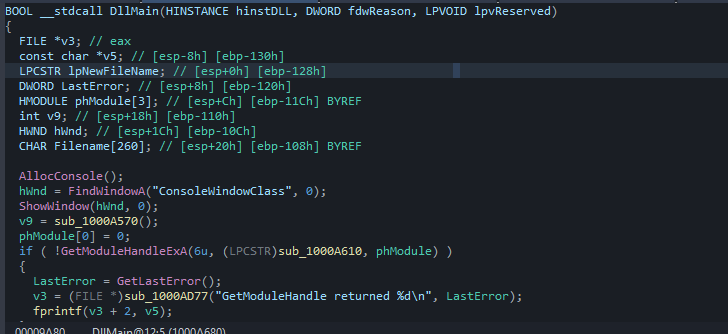

These API imports indicate that the DLL functions as a userland keylogger.

---

## 2. Reversing the Keypress Loops

We load the DLL in IDA Pro and trace the execution path. The logger registers hooks and loops through key values inside a central handler function:

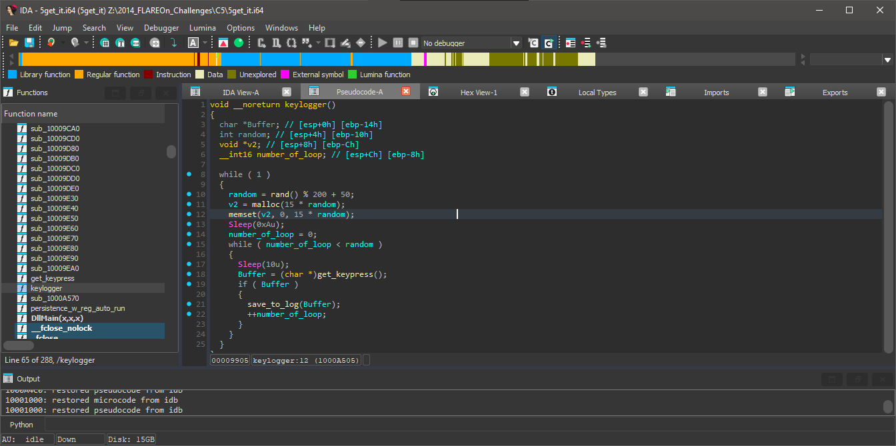

The handler calls `get_keypress`, which executes `GetAsyncKeyState` to capture key inputs:

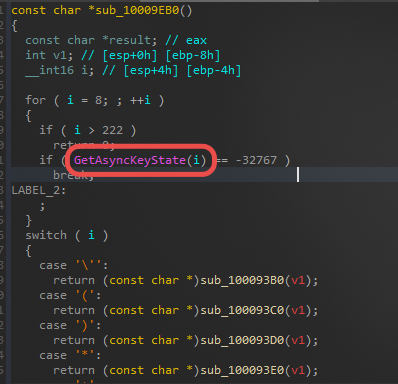
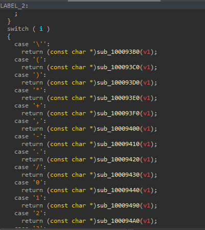

The function matches the logged keys using a large switch-case block. 

### The 'M' Key Handler

We inspect the case block for the 'M' key to trace its subroutines:

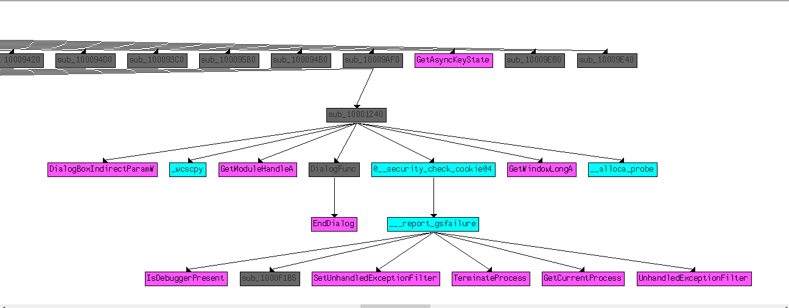
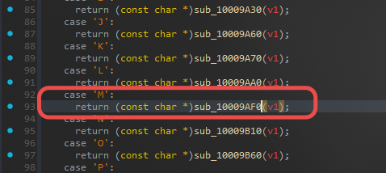

```c
const char *sub_10009AF0()
{
  if ( dword_100194FC > 0 )
  {
    _cfltcvt_init();
    sub_10001240();
  }
  return "m";
}
```

The handler calls `sub_10001240()`, which displays a dialog box showing the Flare logo:

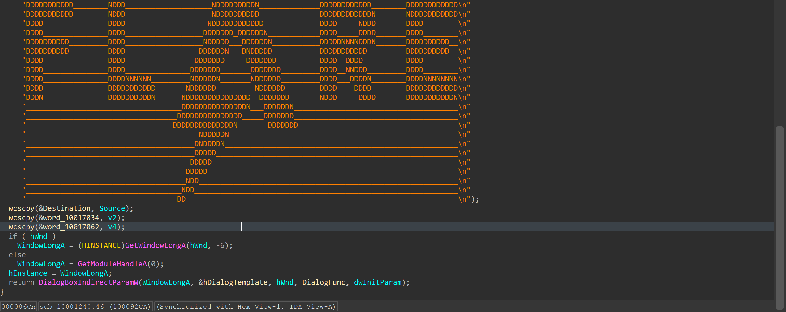

### Globals and the `_cfltcvt_init` Function

Every character case handler calls a common initialization routine, `_cfltcvt_init`:

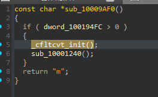

Inspecting `_cfltcvt_init` reveals that it zeroes out a contiguous array of global variables in memory:

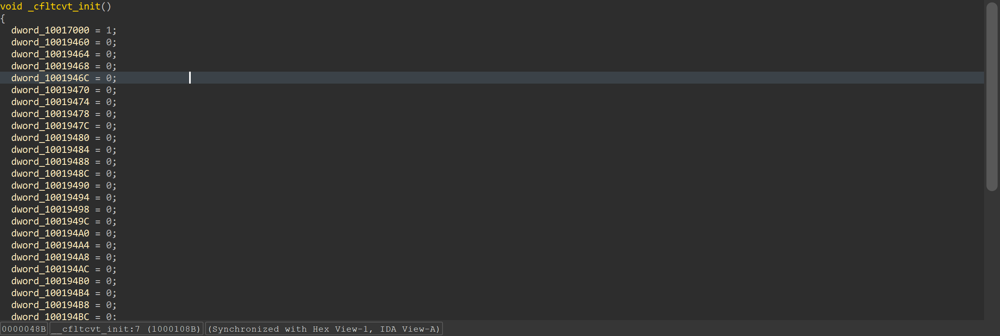

The handlers for individual keys set these global flag variables to `1` when their respective key is pressed. For example, looking at cross-references for `dword_10019460` shows the handler for the 'L' key updating this value:

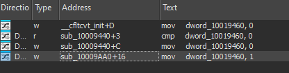
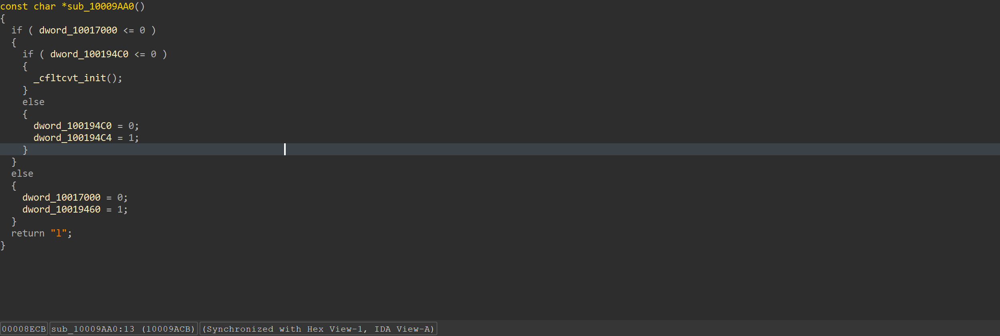

Each keypress sets a specific global flag variable to `1`. Because the globals are cleared sequentially in memory by `_cfltcvt_init` (spanning from `0x10019460` to `0x10019500`), the linear layout of these flags in memory maps directly to the character order of the decryption key.

---

## 3. Automating Key Extraction with IDA Python

Rather than manually mapping all switch cases to global variable offsets, we write an IDA Python script to automate the extraction.

The script walks the DLL's functions, identifies key handler blocks, scans for instructions that assign characters to `eax` or set global flags to `1`, and builds the final flag string:

```python
import ida_funcs
import idautils
import idc

chars = {}

for f_ea in idautils.Functions():
    ret_char = None
    set_states = []

    for ea in idautils.FuncItems(f_ea):
        if idc.print_insn_mnem(ea) != "mov":
            continue

        dst = idc.print_operand(ea, 0)
        src = idc.print_operand(ea, 1)

        # mov eax, offset "char"
        if dst.lower() == "eax" and "offset" in src:
            saddr = idc.get_operand_value(ea, 1)
            s = idc.get_strlit_contents(saddr, -1, idc.STRTYPE_C)
            if s:
                ret_char = s.decode(errors="ignore")

        # mov dword_xxxx, 1
        if dst.startswith("dword_") and src == "1":
            set_states.append(idc.get_operand_value(ea, 0))

    if ret_char:
        for state in set_states:
            chars[state] = ret_char

# Read memory addresses sequentially from _cfltcvt_init
start = 0x10019460
end   = 0x10019500
flag = ""

print("==== Ordered mapping ====")
for addr in range(start, end + 1, 4):
    if addr in chars:
        c = chars[addr]
        print(f"dword_{addr:X} -> {c}")
        flag += c
    else:
        print(f"dword_{addr:X} -> ?")

print("\nFLAG:")
print(flag)
```

Running the script in IDA extracts the key mappings and reconstructs the flag:

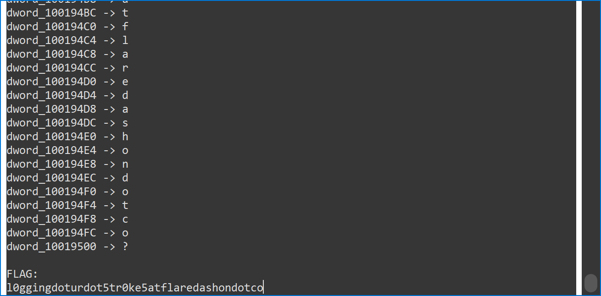

The keylogger mapping yields the final flag email:
`l0gging.ur.5tr0ke5@flare-on.com`
