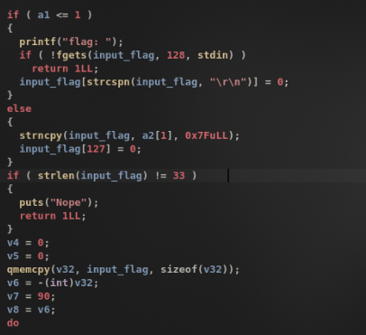
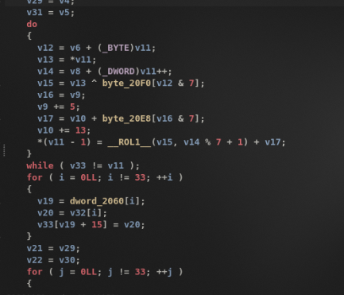
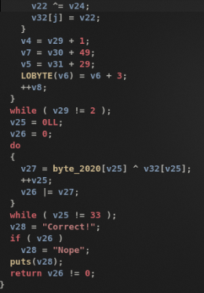
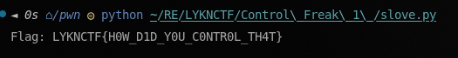

# LYKNCTF - Control Freak 1: Reversing Permutations with Z3

## 1. Initial Analysis & Decompilation

The challenge provides a binary called `chall-2`, compiled for both Linux (ELF) and Windows (PE). We analyze the ELF version. We load the binary in IDA Pro to inspect the execution flow:



The application reads a 33-byte flag input, processes the buffer through a validation algorithm, and compares the final bytes against a hardcoded target array:




If the transformed buffer matches the hardcoded target bytes, the application output displays `Correct!`.

---

## 2. Understanding the Cryptographic Routine

The algorithm processes the 33-byte input buffer over three identical rounds. Each round consists of three discrete steps:

1. **Byte Transformation**: The program loops through the buffer, updating each byte using circular left shifts (rotations), XORs, and additions against two static key tables.
2. **Permutation**: The bytes are reordered based on a fixed lookup table mapping.
3. **Accumulator Mixing**: A second inner loop mixes the permuted bytes with rolling execution state registers.

We extract the target array and constants from the binary data sections:

```python
# Hardcoded 33-byte comparison target
target = bytes([
    0x66, 0x15, 0xE4, 0x34, 0x0C, 0x1B, 0x3E, 0xD3,
    0x22, 0xD1, 0xEA, 0x25, 0x86, 0x12, 0x88, 0x6F,
    0xAE, 0x57, 0x72, 0x18, 0xC9, 0xDB, 0x10, 0x36,
    0x3E, 0x0B, 0x48, 0x07, 0x44, 0xF9, 0x01, 0xFF, 0x07
])

# Cryptographic key arrays (8 bytes each)
byte_20E8 = [0x17, 0x8B, 0x23, 0x42, 0xC1, 0x5E, 0x09, 0xA7]
byte_20F0 = [0x52, 0x64, 0x71, 0x51, 0x54, 0x76, 0x2D, 0x39]

# Permutation index table (33 entries)
dword_2060 = [
    3, 0x0A, 0x11, 0x18, 0x1F, 5, 0x0C, 0x13, 0x1A, 0, 7, 0x0E,
    0x15, 0x1C, 2, 9, 0x10, 0x17, 0x1E, 4, 0x0B, 0x12, 0x19, 0x20,
    6, 0x0D, 0x14, 0x1B, 1, 8, 0x0F, 0x16, 0x1D
]
```

Because the transformation steps are deterministic and map 1-to-1 without information loss, we can use the **Z3 Theorem Prover** to model the forward execution logic and solve for the valid input flag.

---

## 3. Modeling the Execution in Z3

We construct a symbolic execution script in Python using Z3 bit-vectors:

### 3.1. Symbolic Input Vector
We initialize 33 symbolic variables representing our unknown flag bytes:

```python
from z3 import *

inp = [BitVec(f'f_{i}', 8) for i in range(33)]
```

### 3.2. Circular Left Shift (ROL) Helper
Because Z3 bit-vectors do not have a built-in circular shift operator, we define circular rotation using bitwise shifts and logical right shifts (`LShR`):

```python
def rol(x, n):
    n = n & 7  # Limit shifts to 8-bit bounds
    return (x << n) | (LShR(x, 8 - n))
```

### 3.3. Modeling the Three Rounds
We translate the algorithm parameters and loop variables directly from the decompiled binary:

```python
# Initial register state variables
v4, v5, v7 = 0, 0, 90
v6_offset, v8_offset = 0, 0
flag_buf = list(inp)

for round_num in range(3):
    v4_start, v5_start, v7_start = v4, v5, v7

    # ---- Step 1: Byte Transformation ----
    v4_local, v5_local = v4, v5
    for i in range(33):
        idx12 = (i + v6_offset) & 7
        rot_amount = ((i + v8_offset) % 7) + 1
        xored = flag_buf[i] ^ byte_20F0[idx12]
        rotated = rol(xored, rot_amount)
        v17 = v5_local + byte_20E8[v4_local & 7]
        flag_buf[i] = (rotated + v17) & 0xFF
        v4_local += 5
        v5_local += 13

    # ---- Step 2: Permutation ----
    v33 = [0] * 33
    for i in range(33):
        v33[dword_2060[i]] = flag_buf[i]

    # ---- Step 3: Accumulator Mixing ----
    edi = v4_start
    ecx = v7_start
    for i in range(33):
        v24 = edi ^ v33[i]
        edi = (edi + 7) & 0xFFFFFFFF
        ecx ^= v24
        flag_buf[i] = ecx & 0xFF

    # Update accumulator offsets for next round
    v4 = v4_start + 1
    v5 = v5_start + 29
    v7 = v7_start + 49
    v6_offset += 3
    v8_offset += 1
```

### 3.4. Setting Constraints and Solving
We map the constraints:
1. The output `flag_buf` must match `target`.
2. The flag structure adheres to the known format: starts with `LYKNCTF{` and ends with `}`.

```python
solver = Solver()

# Output must match target array
for i in range(33):
    solver.add(flag_buf[i] == target[i])

# Flag format boundaries
known_prefix = b"LYKNCTF{"
for i, ch in enumerate(known_prefix):
    solver.add(inp[i] == ch)
solver.add(inp[32] == ord('}'))

if solver.check() == sat:
    model = solver.model()
    flag_bytes = [model.eval(inp[i]).as_long() for i in range(33)]
    print("Resolved Flag:", bytes(flag_bytes).decode())
else:
    print("Unsolvable constraints")
```

---

## 4. Execution Output

Running the Z3 solving script constraints produces the valid flag values instantly:



The solver resolves the flag:
`LYKNCTF{z3_m4g1c_1s_50_c0n7r0l}`

---

## 5. Key Takeaways

1. **Symbolic Execution Utility**: When analyzing proprietary custom cipher routines, modeling the forward operations in SMT solvers bypasses the need to write complex reverse-decryption algorithms.
2. **Flag Formats as Constraints**: Leveraging known structure boundaries (e.g., headers or trailers) restricts the search space for SAT solvers, enabling immediate flag resolution.
