# LYKNCTF - Cr3ck 1: KeygenMe & Anti-Debugging Bypass

## 1. Initial Analysis & Decompilation

The challenge provides a Windows binary called `KeygenMe.exe`. We load the binary into IDA Pro to audit its structure and logic flow. 

Tracing the entry point (`start`) reveals that the keygen initializes a GUI window. The window initialization logic resides inside `sub_1400030E0`:

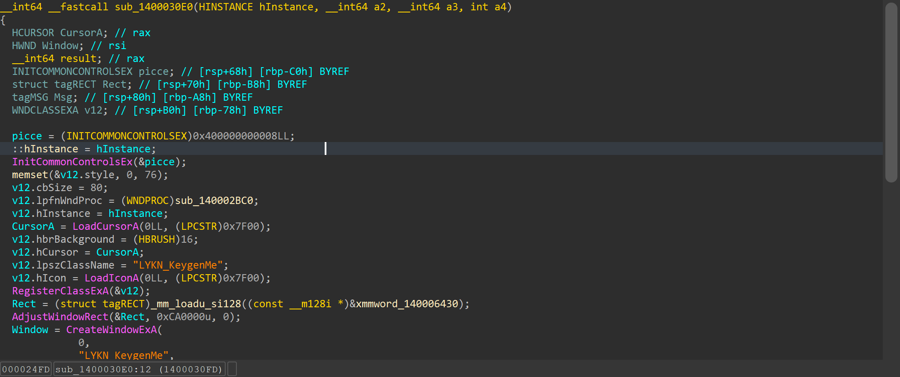

Drawing operations and window updates run within `sub_140002BC0`. We trace the application's click event handlers to locate the validation logic:

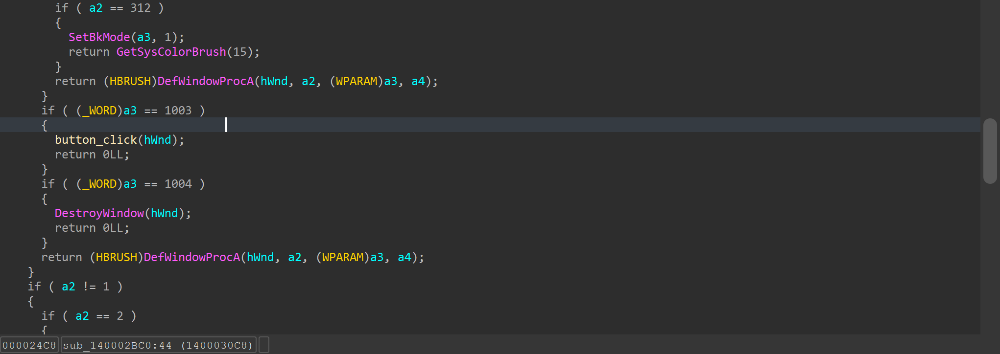

When the user clicks the verification button, the handler validates that the input username length is at least 4 characters before invoking the license checking logic:

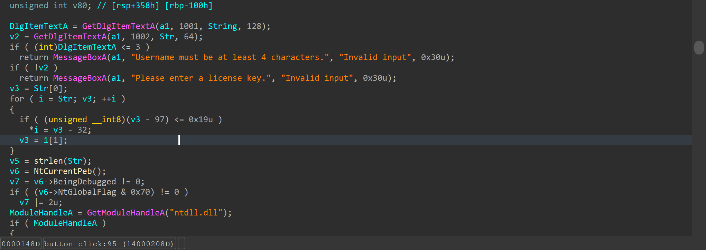

---

## 2. Anti-Debugging Analysis

The license checking routine implements four concurrent anti-debugging techniques to set a debugger tracking flag `v7`:

```c
// Using BeingDebugged and NtGlobalFlag in PEB
v7 = v6->BeingDebugged != 0;

if ( (v6->NtGlobalFlag & 0x70) != 0 )
    v7 |= 2u;

ProcAddress = GetProcAddress(ModuleHandleA, "NtQueryInformationProcess");
v10 = (__int64 (__fastcall *)(_QWORD, _QWORD, _QWORD, _QWORD, _QWORD))ProcAddress;
if ( ProcAddress )
{
  *(_DWORD *)String2 = 1;
  *(_QWORD *)Text = 0LL;
  
  // Query ProcessDebugPort (7)
  if ( !((unsigned int (__fastcall *)(__int64, __int64, CHAR *, __int64, _QWORD))ProcAddress)(
          -1LL,
          7LL,
          Text,
          8LL,
          0LL)
    && *(_QWORD *)Text )
  {
    v7 |= 4u;
  }
  
  // Query ProcessDebugFlags (31)
  v11 = v10(-1LL, 31LL, String2, 4LL, 0LL);
  if ( !(*(_DWORD *)String2 | v11) )
    v7 |= 8u;
}
```

The application uses these checks:
1. **`BeingDebugged` Flag**: Inspects the Process Environment Block (PEB).
2. **`NtGlobalFlag`**: Inspects flags set by Windows when a process starts under a debugger.
3. **`NtQueryInformationProcess` with `ProcessDebugPort` (7)**: Verifies if a debug port is attached.
4. **`NtQueryInformationProcess` with `ProcessDebugFlags` (31)**: Queries the debug state.

If any check flags a debugger, `v7` becomes non-zero. The license generation logic relies on `v7`:

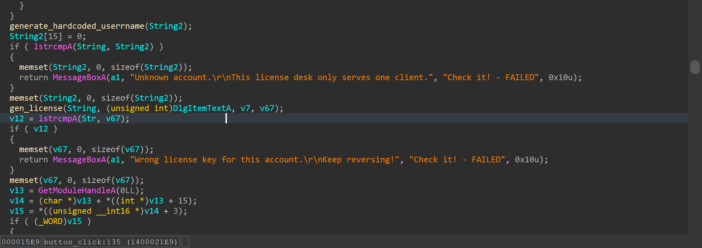

If the process runs inside a debugger, the generated license updates dynamically, rendering it invalid for regular runs. Furthermore, the validation routine performs SHA-256 hash checks, comparing values against a hardcoded target hash `0x2679DDA8691CB57D`:

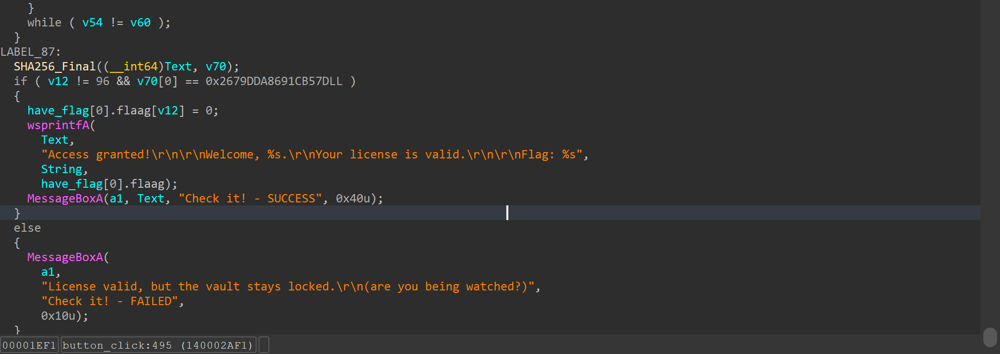

---

## 3. Bypassing Mitigations via ScyllaHide

Rather than manually patching the binary's conditional jumps, we use **x64dbg** equipped with the **ScyllaHide** anti-debugging bypass plugin. We configure ScyllaHide to hook the PEB queries and hide the debugger's presence:

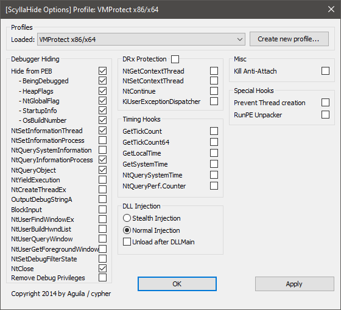

We launch `KeygenMe.exe` inside x64dbg. The plugin successfully bypasses the checks, launching the GUI cleanly:

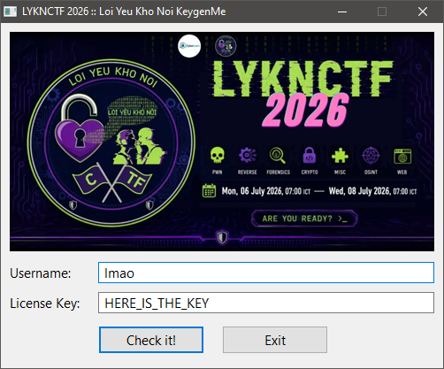

---

## 4. Recovering the Credentials

We enter test values into the inputs. In IDA, we locate the username generation block and copy its absolute address. We set a breakpoint at this location inside x64dbg and trigger the verification:

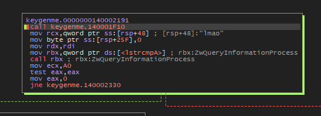

The debugger hits our breakpoint. We step through the execution path, inspecting the registers to recover the hardcoded username target:

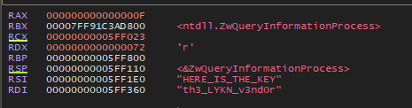

The application expects the username: `th3_LYKN_v3nd0r`.

We restart the process, supply `th3_LYKN_v3nd0r` as the username, and set a breakpoint at the license generator block:

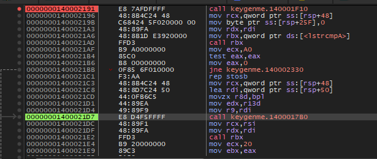

Stepping through the code execution resolves the expected license string inside the registers:

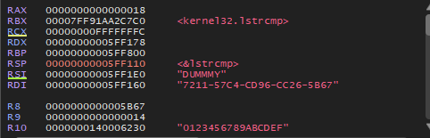

The generator yields the license: `7211-57C4-CD96-CC26-5B67`.

---

## 5. Flag Validation

We run the keygen binary directly on the host system without the debugger, entering the recovered credentials:
- **Username**: `th3_LYKN_v3nd0r`
- **License**: `7211-57C4-CD96-CC26-5B67`

The keygen validates the inputs and prints the flag:

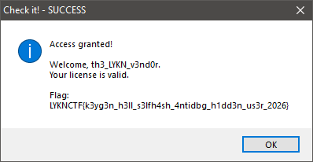
