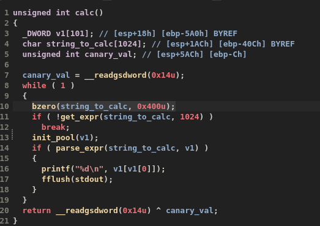
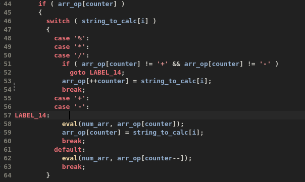
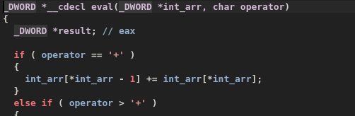
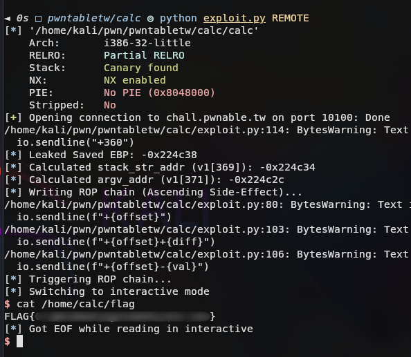

# Pwnable.tw - Calc

## Initial Analysis
- **Binary**: `calc`
- **Protections**:
    - **Canary**: Enabled. Identified `__readgsdword(0x14u)` in `calc()`. This prevents standard buffer overflows by checking a secret value before returning.
    - **NX**: Enabled. The stack is not executable (cannot run shellcode directly).
    - **PIE**: Disabled. Addresses are fixed (0x8048000), making ROP easier.

## Code Analysis
### `calc()`
- We decompiled `calc()` and saw a `while(1)` loop processing expressions.
- We identified the Stack Canary protection: `v3 = __readgsdword(0x14u)` at the start and the XOR check `__readgsdword(0x14u) ^ v3` at the end

## Finding the Vulnerability

The vulnerability is a logic bug in how `parse_expr` handles operators at the beginning of an expression.

If we send an expression starting with an operator (e.g., `+300`), `eval()` is called before any numbers are pushed to the stack.

1. `eval()` executes with `v1[0]` (count) as `0`.
2. It tries to access `v1[-1]` (OOB read), performs an operation, and decrements `v1[0]` to `-1`.
3. Then `parse_expr` parses the number `300`. It increments `v1[0]` back to `0` and writes `300` to `v1[0]`.

**Result**: We have overwritten `v1[0]` (the stack counter) with `300`.
Subsequent operations will use this corrupted counter index (300) to access memory far outside the `v1` array bounds, allowing arbitrary Read/Write on the stack.

## Exploitation Strategy

### 1. Leak Stack Address
Since ASLR is enabled, we need to know the address of the stack to point to our string `/bin/sh`.
- `v1[0]` starts at `ebp - 0x5A0` (1440 bytes).
- `v1` is an array of 4-byte integers.
- `1440 / 4 = 360`.
- Therefore, `v1[360]` corresponds to `ebp` (Saved Base Pointer).
- By sending `+360`, we leak the value of the Saved EBP, which points to the caller's stack frame. We can use this to calculate the address of our buffer.

### 2. ROP Chain
With **NX** enabled, we cannot execute shellcode. We must construct a ROP chain to call `execve("/bin/sh", 0, 0)`.
We need to set the registers:
- `eax` = 11 (`0xb`)
- `ebx` = pointer to `/bin/sh`
- `ecx` = 0
- `edx` = 0
- `int 0x80`

**Gadgets Used** (found using `ROPgadget --binary calc`):
- `pop eax; ret` (`0x0805c34b`)
- `pop edx; ret` (`0x080701aa`)
- `pop ecx; pop ebx; ret` (`0x080701d1`)
- `int 0x80` (`0x08049a21`)

Example command: `ROPgadget --binary calc | grep "pop eax ; ret"`

### 3. Writing the Payload
Using the OOB write primitive, we write the ROP chain starting at `v1[361]` (Return Address).
We will overwrite the stack frame as follows:

| Index | Offset | Content | Purpose |
| :--- | :--- | :--- | :--- |
| `v1[360]` | `ebp` | Saved EBP | Leak target address |
| `v1[361]` | `ebp+4` | `pop eax; ret` | Gadget 1 (Return Address) |
| `v1[362]` | `ebp+8` | `11` | syscall number for `execve` |
| `v1[363]` | `ebp+12` | `pop edx; ret` | Gadget 2 |
| `v1[364]` | `ebp+16` | `0` | envp = NULL |
| `v1[365]` | `ebp+20` | `pop ecx; pop ebx; ret` | Gadget 3 |
| `v1[366]` | `ebp+24` | `0` | argv = NULL |
| `v1[367]` | `ebp+28` | **Stack Address of String** | Pointer to `/bin/sh` (for `ebx`) |
| `v1[368]` | `ebp+32` | `int 0x80` | Syscall Trigger |
| `v1[369]` | `ebp+36` | `/bin` | String Part 1 |
| `v1[370]` | `ebp+40` | `/sh\0` | String Part 2 |

We place the string `/bin/sh` at the end (`v1[369]`) so we can point `ebx` to it easily.

### 4. Overcoming Limitations (The "Ascending Write" Strategy)
During exploitation, we encountered a critical constraint:
- `parse_expr` checks `if (v9 > 0)` before assigning to the array.
- This means **we cannot directly write negative numbers** (or large unsigned integers like `0xffff...`) to the stack.
- Attempting to write a gadget address like `0x08049a21` works, but a stack address like `0xffffd5c8` fails because it's interpreted as a negative integer by `atoi`.

#### The Solution: Side-Effect Writes
The `eval` function logic is: `v1[offset-1] += v1[offset]`.
We can use this side-effect to write *any* value to `v1[offset-1]` by manipulating `v1[offset]`.

**Algorithm**:
To write `TARGET` to `v1[K]`:
1. We target the *next* index `K+1` as a "helper".
2. We calculate `DIFF = TARGET - v1[K]`.
3. We send `+(K+1)+DIFF`.
   - `parse_expr` sets `v1[K+1] = DIFF`.
   - `eval` executes `v1[K] += v1[K+1]`.
   - Result: `v1[K]` becomes `TARGET`.

**Ordering Matters**:
We must write from **Lowest Index (361) to Highest (372)**.
- Step 1: Fix `v1[361]` (Return Address) using `v1[362]` as helper.
- Step 2: Fix `v1[362]` (using `v1[363]` as helper). This overwrites the "garbage" diff we used in Step 1.
- ...
- Step N: Fix `v1[372]` (last element).

### 5. Final Stack Layout
We construct the following ROP chain using the strategy above:

| Index | Content | Purpose |
| :--- | :--- | :--- |
| `v1[360]` | `Saved EBP` | Leaked (Start of frame) |
| `v1[361]` | `pop eax; ret` | Gadget 1 |
| `v1[362]` | `11` | Syscall 11 (`execve`) |
| `v1[363]` | `pop edx; ret` | Gadget 2 |
| `v1[364]` | `0` | `envp` |
| `v1[365]` | `pop ecx; pop ebx; ret` | Gadget 3 |
| `v1[366]` | `Stack Addr (argv)` | `ecx` -> `argv` array |
| `v1[367]` | `Stack Addr (str)` | `ebx` -> `/bin/sh` |
| `v1[368]` | `int 0x80` | Syscall Trigger |
| `v1[369]` | `/bin` | String 1 |
| `v1[370]` | `/sh\0` | String 2 |
| `v1[371]` | `Stack Addr (str)` | `argv[0]` |
| `v1[372]` | `0` | `argv[1]` |

This robust chain handles the environment variations and `atoi` limitations perfectly.

## Getting the flag

Following the exploitation strategy, the final steps were executed:
1. **Stack Leak**: Sent `+360` to leak the Saved EBP and calculate stack addresses for the ROP chain.
2. **OOB Write**: Used the "Ascending Write" strategy to place the gadgets and the `/bin/sh` string on the stack.
3. **Execution**: Sent an empty newline to trigger the function return and hijack the control flow.

Executing the final payload successfully grants a shell:

The logic bug in `parse_expr` enabled arbitrary stack manipulation, which, combined with the lack of PIE, turned a simple OOB access into remote code execution.
